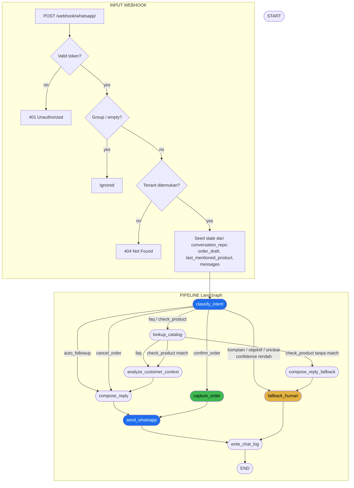
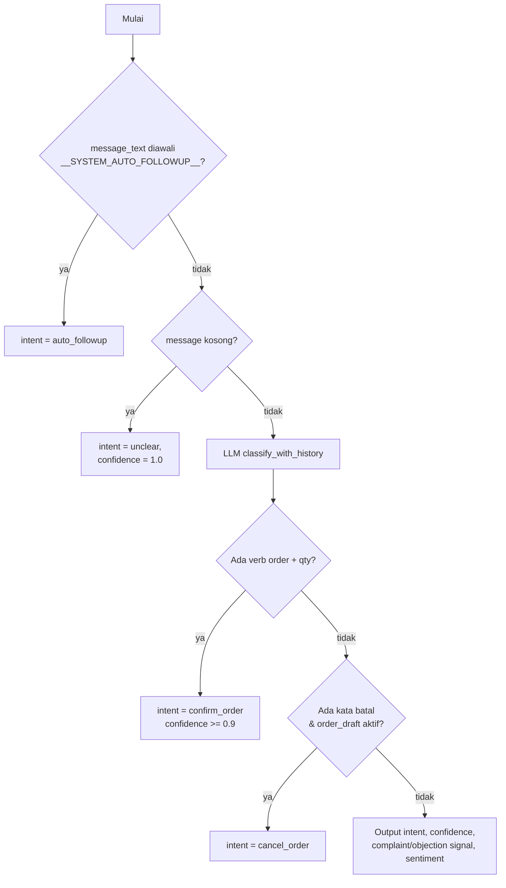
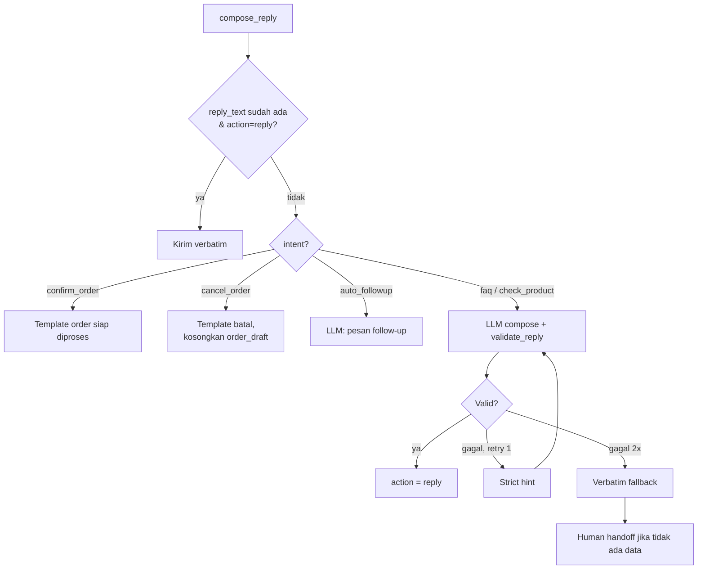
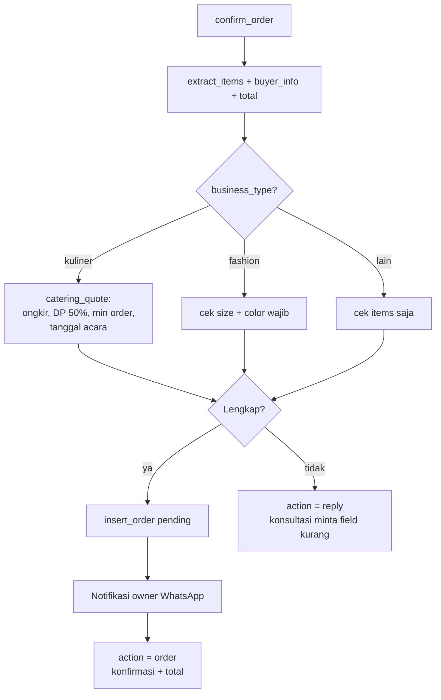
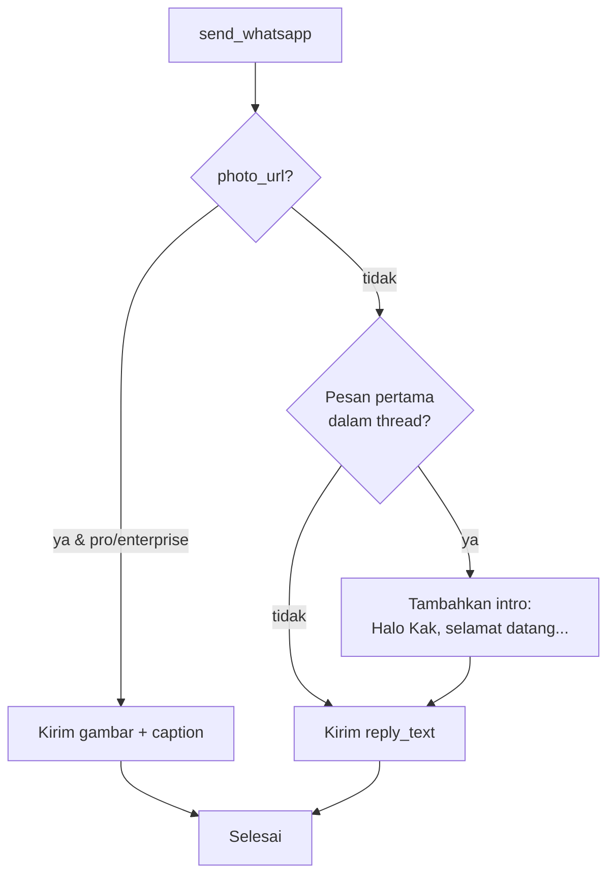
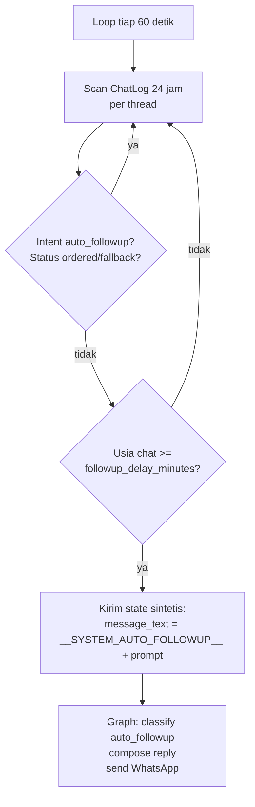
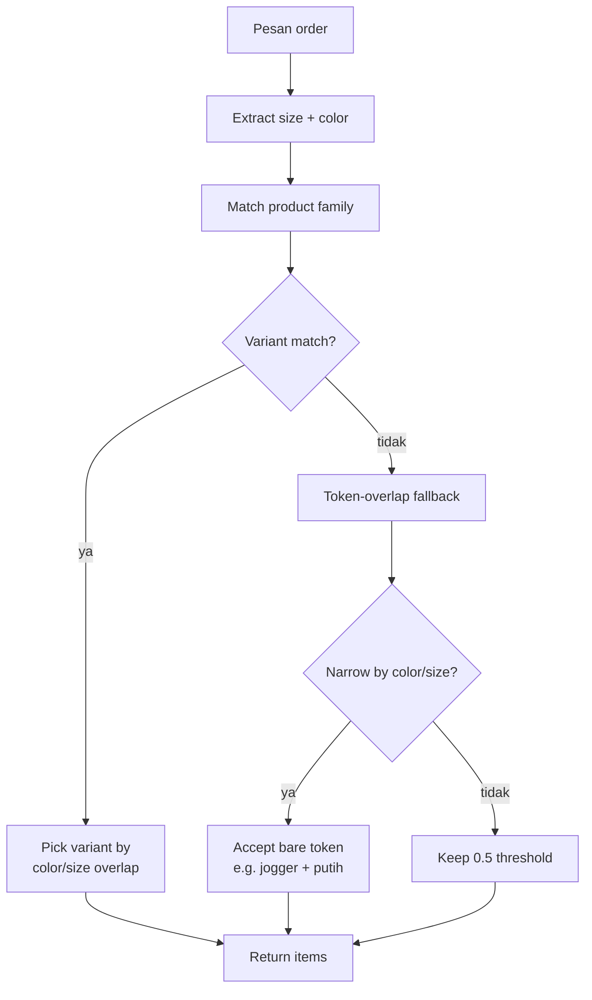

# Flowchart Agen Balesin.ai

Diagram ini menjelaskan alur percakapan agent WhatsApp berdasarkan kode di:

- `app/main.py` — webhook & persistence
- `app/graph/graph.py` — routing & graph assembly
- `app/graph/nodes.py` — node implementations
- `app/services/followup.py` — anti-ghosting background loop
- `app/services/order_extractor.py` — deterministic order parsing

Render dengan Mermaid di GitHub, VS Code, atau https://mermaid.live.

---

## 1. Alur Utama (Graph)



---

## 2. Rincian Node

### 2.1 classify_intent (`nodes.py:208`)



**Catatan:**

- `cancel_order` hanya muncul jika ada `order_draft` non-kosong di state.
- `confirm_order` juga bisa di-override dari `faq` jika pesan mengandung kata order + kuantitas.

### 2.2 compose_reply (`nodes.py:500`)



### 2.3 capture_order (`nodes.py:1013`)



**Catatan multi-turn:**

- `order_draft` dibawa antar pesan lewat `conversation_repo`.
- Buyer bisa menambah/ubah item: "tambah hoodie 1", "jadi 3 kaos hitam".
- Jika memesan ulang setelah konfirmasi, draft kosong kembali.

### 2.4 Order Cancellation

```mermaid
flowchart TD
    A[Pesan: batalkan pesanan saya] --> B{order_draft aktif?}
    B -- ya --> C[classify_intent override<br/>intent = cancel_order]
    C --> D[compose_reply cancel]
    D --> E[order_draft = []]
    E --> F[Webhook persist empty draft]
    B -- tidak --> G[Perlakukan sebagai FAQ/unclear]
```

### 2.5 send_whatsapp (`nodes.py:782`)



---

## 3. Anti-Ghosting Follow-up (`app/services/followup.py`)



---

## 4. Order Extraction (`app/services/order_extractor.py`)



---

## 5. Routing Rules

| Fungsi | File | Aturan |
|--------|------|--------|
| `should_fallback` | `graph.py:47` | True jika complaint/objection, `unclear` (kecuali pesan pertama), atau confidence < 0.6. |
| `route_after_classify` | `graph.py:64` | Prioritas: `auto_followup` / `cancel_order` → compose, lalu fallback, lalu `confirm_order` → capture, sisanya lookup. |
| `route_after_lookup` | `graph.py:80` | `faq` → context analyzer; `check_product` tanpa match → fallback; lainnya → context analyzer. |

---

## 6. Persona & Jawaban

Persona per `business_type` disimpan di `app/graph/prompts.py`. Setiap persona menyertakan:

- Sapaan hangat di pesan pertama.
- Akhiri balasan dengan pertanyaan pemandu.
- Gunakan data dari katalog/FAQ; jangan mengarang angka/fakta.

Welcome message custom bisa diatur lewat `onboarding_data.welcome_message` di `TenantConfig`.
